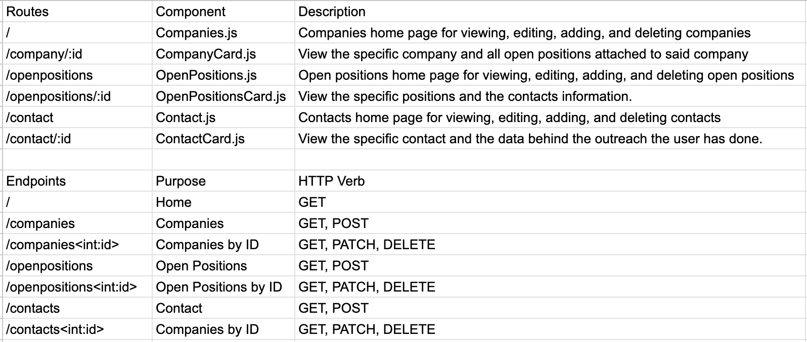

# Title of Application

## Description
A web based application boot-camp grads can use to get their dream job.

## User Stories

- User can store data on specific companies they are interested in working for.
- User can perform CRUD actions keep the data in their CRM relevant to their search.
- User can keep track out their warm prospects for interviews.

## Stretch Goals

- Users can store templates for outreach.
- Users can get redirected to a contacts linkedin page.
- Users can have a warm contacts page.

## Wire Frame

## Schema

## React Tree

## Routes and End Points

## Kanban Board

